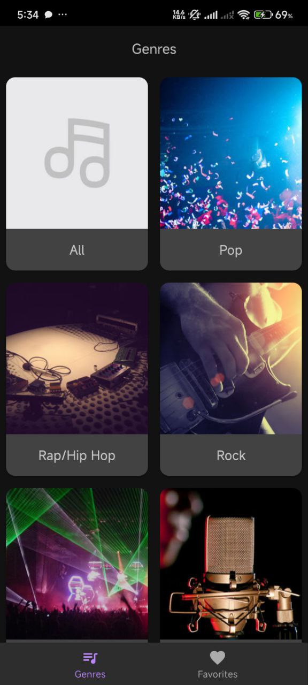
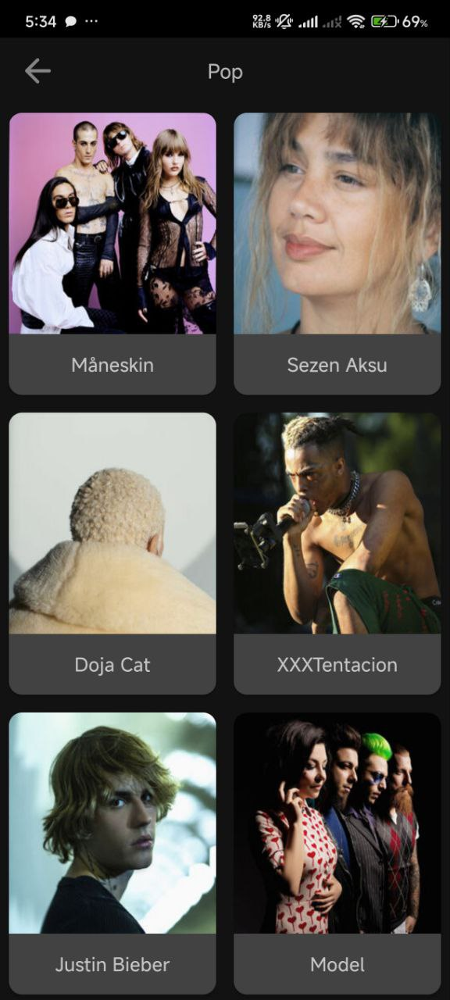
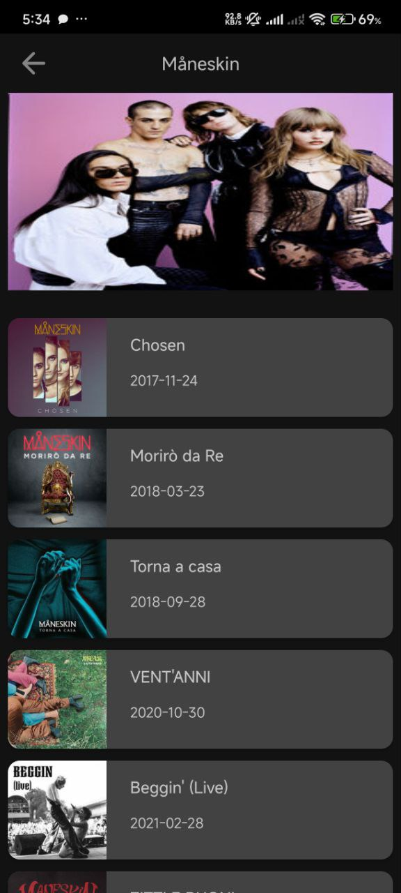
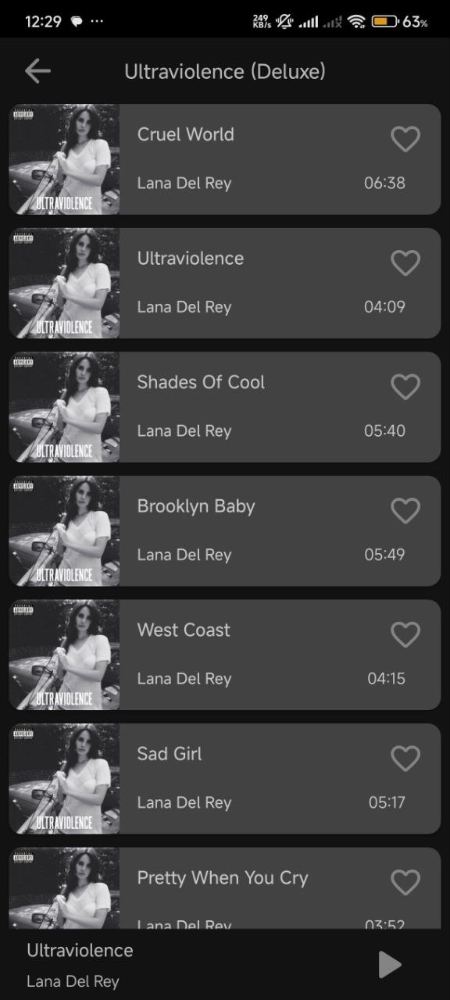
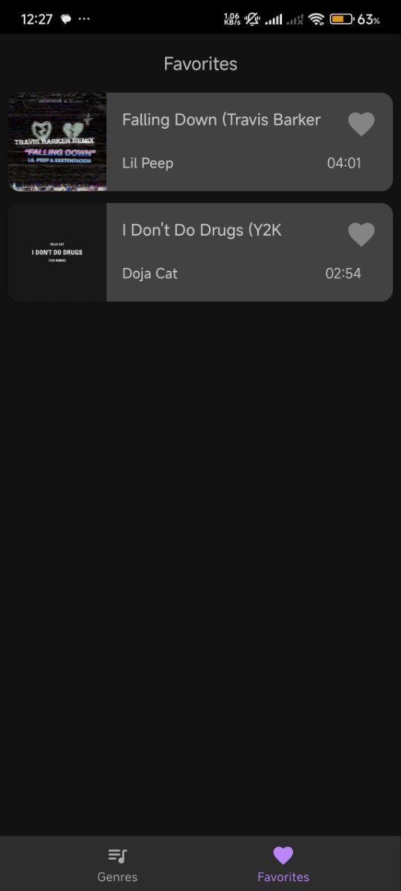
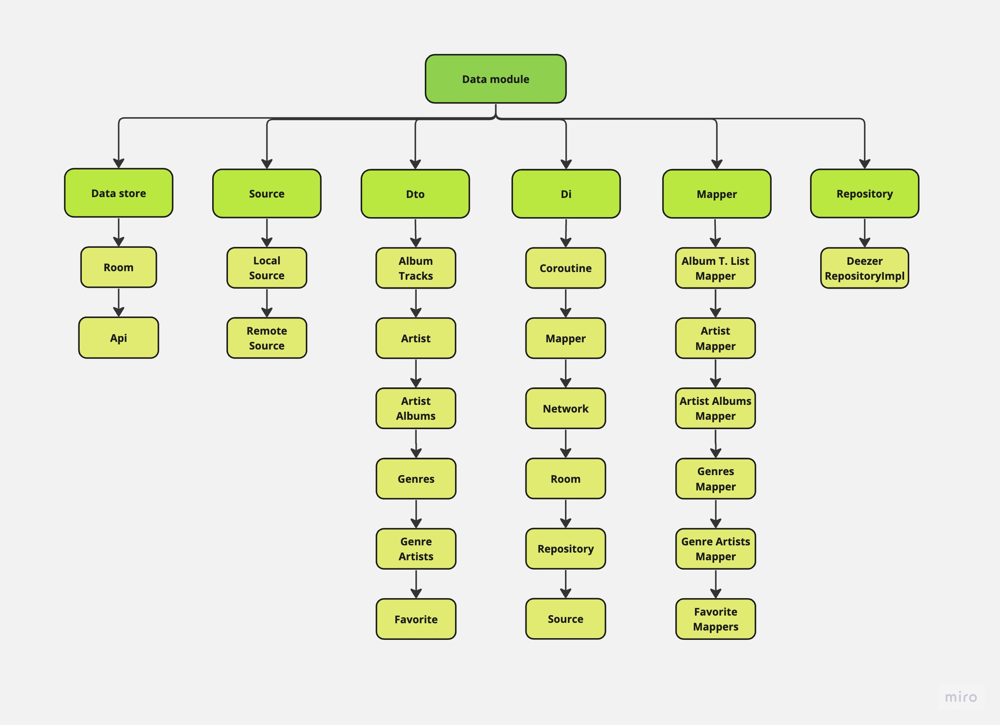
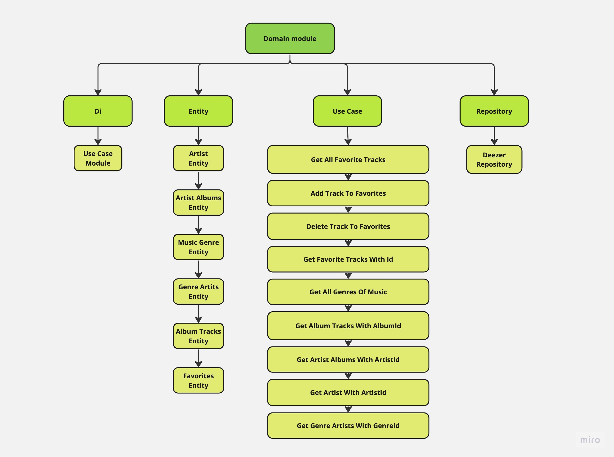
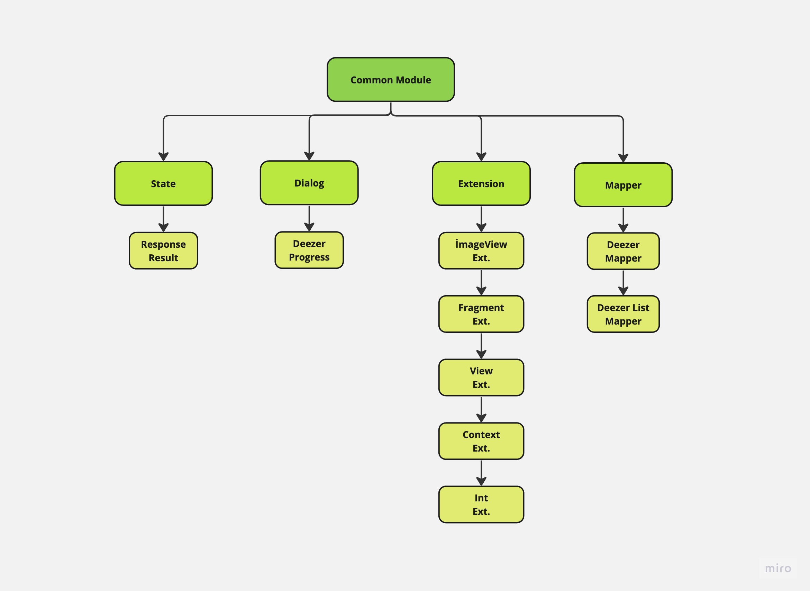
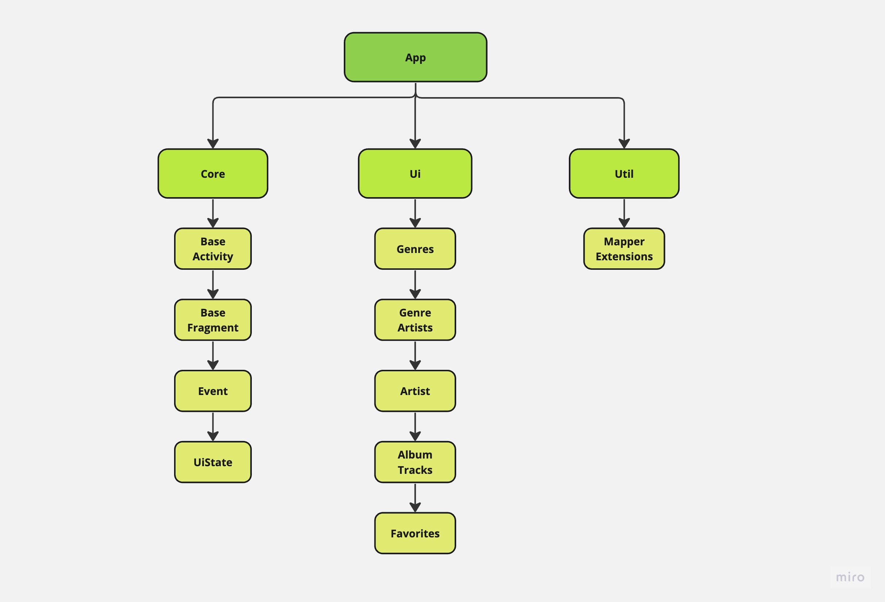

# Mobile Application Development Project

## Authors: Kamal Ahmadov (kamal.ahmadov1@ufaz.az), Rufat Guliyev (r.guliyev1@ufaz.az)

## Musical Player App

Musical Player App is an Android application built for exploring music, creating playlists, and managing favorite tracks, leveraging the Deezer API. While the project was envisioned to include a quiz feature, the current focus is on providing a robust and seamless music player experience. 

## Project Prerequisites

To run the project properly, ensure the following prerequisites are met:

- **JVM Version**: The application requires **JVM version 17** for maximum compatibility and optimal performance. Ensure that your development environment is configured with the correct version of the Java Virtual Machine.
  
- **JetBrains Runtime (JBR)**: It is recommended to use **JetBrains Runtime**, which is a custom runtime optimized for IntelliJ IDEA and other JetBrains IDEs. This ensures better performance, stability, and compatibility with the development tools used for the project.

## Project Screens
GENRES SCREEN | ARTISTS SCREEN | ARTIST SCREEN | 
--- | --- | --- | 
 | | |

ALBUM SCREEN | TRACK SCREEN | FAVORITES SCREEN | 
--- | --- | --- | 
 | | |

## Project Tech Stack Overview

The application leverages the following modern technologies and tools, each serving a specific purpose in the development process:

---

- **[Kotlin](https://developer.android.com/kotlin)**  
  Kotlin is the primary programming language for the app, chosen for its concise syntax, improved safety features, and robust integration with Android development tools.

---

- **[ViewModel](https://developer.android.com/topic/libraries/architecture/viewmodel)**  
  The `ViewModel` component is part of Android's architecture components and is used to manage UI-related data in a lifecycle-conscious way. It ensures that data survives configuration changes like screen rotations.

---

- **[Kotlin Flow](https://developer.android.com/kotlin/flow)**  
  Kotlin Flow is a reactive streams API used for handling asynchronous data streams. It provides a clean way to manage and observe data changes, ensuring efficient state management in the app.

---

- **[Kotlin Coroutines](https://developer.android.com/kotlin/coroutines)**  
  Coroutines simplify asynchronous programming by providing a structured concurrency approach. They are used in the app for managing tasks like API calls, database operations, and other background processes without blocking the main thread.

---

- **[Dependency Injection with Hilt](https://developer.android.com/training/dependency-injection/hilt-android)**  
  Hilt is a dependency injection framework that simplifies the process of providing and managing dependencies across the application, promoting modular and testable code.

---

- **[Navigation Component](https://developer.android.com/guide/navigation)**  
  This component is used to handle in-app navigation, including fragment transitions and deep linking. It simplifies navigation logic and ensures a smooth user experience.

---

- **[Retrofit](https://square.github.io/retrofit/)**  
  Retrofit is a type-safe HTTP client used for making API requests to the Deezer API. It simplifies the process of sending network requests and parsing responses.

---

- **[LiveData](https://developer.android.com/topic/libraries/architecture/livedata)**  
  LiveData is an observable data holder class used to notify UI components of data changes in a lifecycle-aware manner. This ensures that UI updates are synchronized with the app's data state.

---

- **[UseCase](https://developer.android.com/topic/architecture/domain-layer)**  
  Use cases encapsulate individual pieces of business logic, ensuring that application logic remains clear and reusable. They act as a bridge between the domain layer and the UI.

---

- **[Repository](https://developer.android.com/topic/architecture/data-layer)**  
  Repositories abstract data sources and provide a unified API for accessing data. They handle communication between the domain layer and the data layer, ensuring separation of concerns.

---

- **[Glide](https://github.com/bumptech/glide)**  
  Glide is an image loading and caching library. It is used in the app to load album covers and other images efficiently, ensuring smooth scrolling and memory management.

---

This stack has been carefully selected to ensure a robust, scalable, and maintainable application while delivering a seamless user experience.

### Architecture Overview

The application adheres to the principles of **Clean Architecture** and implements the **MVVM (Model-View-ViewModel)** pattern to ensure maintainability, scalability, and separation of concerns. The project is organized into the following distinct modules:

---

#### **Data Module**
This module encompasses the **data layer**, responsible for interacting with external data sources such as APIs, databases, or other storage mechanisms. It handles data retrieval, processing, and storage. Typical components within this module include:

- **Room database** operations for local data persistence.
- **Retrofit API calls** for network communication.
- Data models representing the application's core entities.

This module focuses on abstracting data sources to ensure they are easily testable and interchangeable.

---

#### **Domain Module**
The domain module encapsulates the **business logic** of the application. It processes data received from the data layer and applies the necessary rules to implement core functionalities. This module is framework-agnostic and serves as the backbone of the application's features. Example responsibilities include:

- User account operations.
- Filtering and sorting anime or other application-specific data.
- Managing favorite lists or similar business rules.

By isolating business logic, this module ensures that the application remains robust and adaptable to changing requirements.

---

#### **Common Module**
This module contains reusable and **shared utilities** to reduce code duplication across the application. It is designed to enhance modularity and promote consistency by housing helper classes, extension functions, and other general-purpose utilities. Examples include:

- Common validation functions.
- Custom error handling mechanisms.
- Shared constants or configurations.

---

#### **App Module**
The App module serves as the **entry point** of the application and is responsible for managing the **user interface (UI)**. It acts as a bridge between the user and the underlying layers, encompassing all UI-related elements such as:

- **Activities** and **Fragments** for managing screens.
- **ViewModels** to maintain UI-related state and communicate with the domain layer.
- **Custom views** and other UI components for a polished user experience.

This module ensures a cohesive and intuitive interaction between the user and the application.

--- 

This modular design promotes maintainability, facilitates testing, and allows for scalability, making the application well-suited for complex and evolving requirements.

---

## Unsolved Technical Challenges

1. **Quiz Implementation:** While envisioned, the quiz functionality is currently not implemented.
2. **Enhanced Offline Support:** Offline editing of playlists remains unaddressed.
3. **Advanced Track Preview:** Playback controls like pause/resume for previews are not yet available.

---

## Future Plans

1. **Quiz Feature:**
   - Add multiple-choice and open-ended quizzes.
   - Include timed game modes and customizable playlists for quizzes.

2. **Advanced Playlist Management:**
   - Allow offline editing and synchronization with the Deezer API.

3. **Enhanced Music Player:**
   - Implement playback controls like pause, resume, and seek.

4. **Analytics Dashboard:**
   - Track user engagement and provide statistics for playlists and favorites.

---

## Contributions

- **Kamal Ahmadov:**
  - Implemented the data layer, including Room database setup and API integration.
  - Developed UI fragments and displaying music tracks.
  - Designed the overall project structure and integrated navigation components.

- **Rufat Guliyev:**
  - Developed the favorites and playlist management functionality.
  - Implemented ViewModels and mapped data flow between layers.
  - Enhanced UI responsiveness.

---

## API Integration

The application interacts with the **[Deezer API](https://developers.deezer.com/api/)**, using the following endpoints:

- **Genres:**
  - `GET /genre` - Fetch all music genres.
- **Artists:**
  - `GET /genre/{id}/artists` - Fetch artists by genre ID.
- **Albums:**
  - `GET /artist/{id}/albums` - Fetch albums by artist ID.
- **Tracks:**
  - `GET /album/{id}/tracks` - Fetch tracks by album ID.